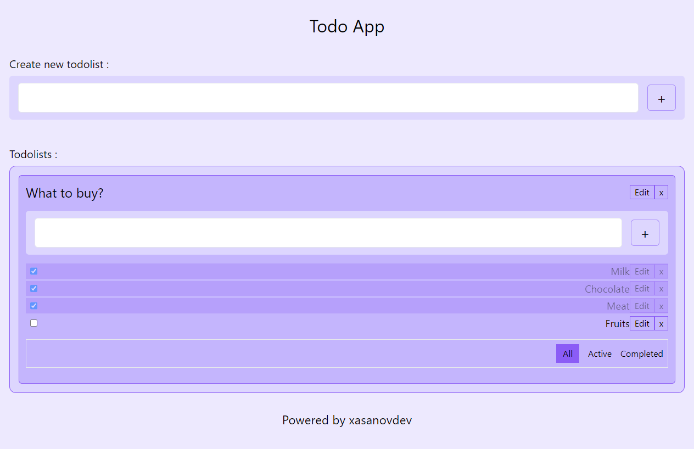

# Typescript va React kutubxonasidan foydalanib yasalgan Todolist App
## Loyiha haqida
Bu loyiha Xasanov Ibrohim tomonidan frontend qismi ishlab chiqilgan.
#### Loyihaning ko'rinishi

## Qulayliklar
- Kunlik rejalarni tuzib chiqa olish
- Har bir ish uchun Todolist yaratib, ularga tasklar bera olish
- Tasklarni bajarilganligi to'g'risida to'liq ma'lumot olish
- **Todolist** va **task**larni nomini o'zgartirish
  > Bu loyiha pet-project bo'lib, asosiy maqsad React hamda TypeScript texnologiyalarini chuqur o'rganish :)
